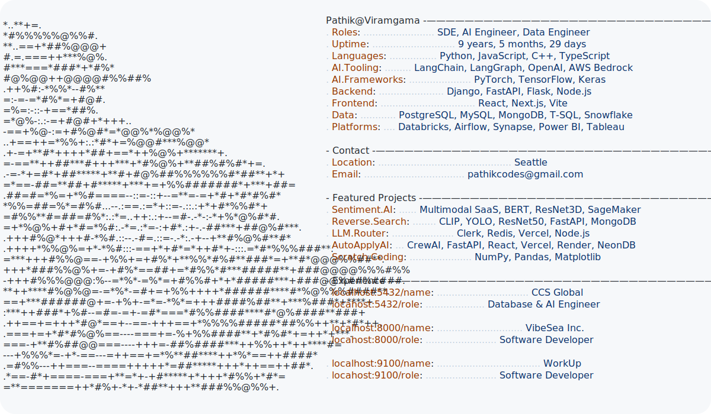

# Hey, I'm [Pathik Viramgama](https://pr0fess0rop.github.io/) 👋

<picture>
  <source media="(prefers-color-scheme: dark)" srcset="assets/dark.svg">
  <source media="(prefers-color-scheme: light)" srcset="assets/light.svg">
  
</picture>
---

## 🤖 About Me

Database and AI Engineer at **CCS Global** building **conversational AI**, **agentic systems**, and the cloud infrastructure that powers intelligent applications at scale.

- 🧠 **Conversational & Agentic AI** — LLM-powered agents, multi-turn dialogue systems, tool-using pipelines on AWS
- ☁️ **AWS Infrastructure** — fault-tolerant backends for real-time AI workloads (Bedrock, Lambda, SQS, DynamoDB, ECS)
- 🔗 **LLM Tooling & RAG** — retrieval-augmented generation, prompt engineering, embeddings, vector search
- ⚙️ **Distributed Systems** — high-throughput microservices, event-driven architectures, low-latency pipelines
- 🌱 **Always building** — LangChain, LangGraph, OpenAI APIs, AWS Bedrock, and emerging agentic frameworks

---

## 🛠️ Tech Stack

**Languages**

**AI / ML**

**Cloud & Infrastructure**

**Frameworks**

**BI & Data Visualization**

--- 
 
## 📌 Featured Projects

| Project | Description | Stack |
|---------|-------------|-------|
| [🎥 SaaS Multi-Model Sentiment Analysis](https://github.com/Pr0fess0rOP/video-sentiment-project) | Multimodel Sentiment Analysis, Deployed on SageMaker along with an SaaS next.js website **54 stars** | Python · Pytorch · BERT · openai · resnet3d · tensorboard · AWS (IAM, S3, EC2, SageMaker, CloudWatch) · Next.js · Typescript · Tailwind CSS · SqLite · node.js|
| [🔍 Reverse Image Search Engine](https://github.com/Pr0fess0rOP/reverse-image-search) | Reverse Image Search Engine using ML and CV | Python · Machine Learning · opencv · FastAPI · MongoDB · CLIP · YOLO · ResNet50 |
| [⚡ LLM Router](https://github.com/Pr0fess0rOP/llm-router) | OpenAI compatible LLM router that lets user connect multiple provider API keys and route requests through single endpoint, handles failure across every provider and monitors usage with detailed logs | React · Node · OpenAI · Clerk · Redis Upstash · Vercel · Encryption |
| [📖 Scratch Coding](https://github.com/Pr0fess0rOP/ML-Scratch-Coding) | Implementing AI algorithms from scratch using three libraries Numpy, Pandas and Matplotlib | Python · Jupiter Notebooks · Numpy · Pandas · Matplotlib |
| [🏦 AutoapplyAI](https://github.com/Pr0fess0rOP/multiagent-autoapply-ai) | FullStack 13-agent job application assistant, built as a SaaS-style MVP with authentication, user-specific history, a credit system, multiple LLM providers, local Ollama support, Google OAuth, and a Bauhaus-inspired React dashboard. | React (Vite) · FastAPI · CrewAI · Google OAuth · Local Ollama API · Tavily API · PyMuPDF · Passlib+bcrypt · Stripe · Gemini API · Groq API · supabase · [llm-router](https://github.com/Pr0fess0rOP/llm-router) |

--- 

## 🔗 Connect

- 🌐 **Portfolio:** [pr0fess0rop.github.io](https://pr0fess0rop.github.io/)
- 📬 **Email:** [pathikcodes@gmail.com](mailto:pathikcodes@gmail.com)

---

*Open to collaborating on conversational AI, agentic systems, and AWS-scale infrastructure. Let's build something impactful.*